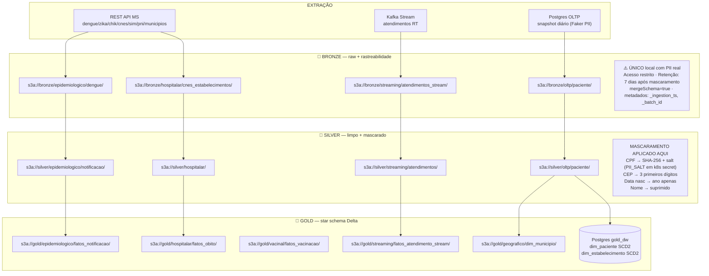
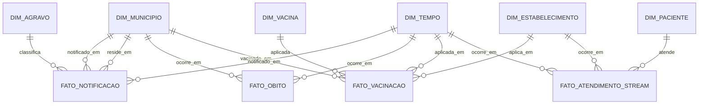

# Arquitetura Técnica — Case Academia Santander Data Engineering

> Documentação da arquitetura, camadas, padrões, modelo dimensional e decisões de tecnologia.

---

## Sumário

- [1. Visão Geral](#1-visão-geral)
- [2. Diagrama de Solução](#2-diagrama-de-solução)
- [3. Diagrama de Fluxo de Dados](#3-diagrama-de-fluxo-de-dados)
- [4. Padrões Arquiteturais](#4-padrões-arquiteturais)
- [5. Serving Layer — Trino + HMS + Delta Lake](#5-serving-layer--trino--hms--delta-lake)
- [6. Modelo Dimensional — Camada Gold](#6-modelo-dimensional--camada-gold)
- [7. Matriz Comparativa de Tecnologias](#7-matriz-comparativa-de-tecnologias)

---

## 1. Visão Geral

Este case implementa uma **Modern Data Platform** baseada em três pilares:

1. **Medallion Architecture** — Bronze → Silver → Gold sobre Delta Lake no MinIO
2. **Data Mesh** — 6 domínios de negócio com ownership e paths isolados (`s3a://{camada}/{domínio}/`)
3. **Arquitetura Lambda** — camada batch (Airflow + Spark) + camada speed (Kafka + Spark Streaming)

**Stack principal:**

| Camada | Tecnologia | Papel |
|---|---|---|
| Ingestão batch | Apache Airflow | Orquestração; `PythonOperator` (extração) + `SparkKubernetesOperator` (transformação) |
| Ingestão streaming | Apache Kafka + Spark Structured Streaming | Eventos em tempo real → Bronze Delta |
| Processamento | Apache Spark 3.5 (k8s) | Bronze→Silver→Gold; mascaramento PII; SCD2 |
| Storage | MinIO (S3-compatible) + Delta Lake | Data lake medalhão; ACID; time travel |
| Catalog | Hive Metastore 4.0 (thrift) | Registro de tabelas Delta para Trino |
| Serving | Trino 448 | Query federada sobre Delta Lake; RBAC |
| Orquestração k8s | Rancher Desktop (k3s) + spark-operator | SparkApplication CRDs; escalabilidade local |
| Observabilidade | Prometheus + Grafana + Marquez | Métricas, dashboards, lineage |
| Qualidade | Great Expectations (`gx/`) | Validações sobre fixtures Pandas |

---

## 2. Diagrama de Solução

> **Abrir:** `docs/assets/01-arquitetura-solucao.drawio` no [Draw.io](https://app.diagrams.net) ou VS Code com extensão Draw.io.

```
┌────────────────────── FONTES DE DADOS ─────────────────────────┐
│  REST API MS    CSV DataSUS    Postgres OLTP    Kafka Stream    │
│  (dengue/cnes)  (histórico)    (pacientes)      (atendimentos)  │
└──────────┬──────────┬──────────────┬───────────────┬───────────┘
           │          │              │               │
    PythonOperator (Airflow)    snapshot diário   producer Faker
           │                                         │
           ▼                                         ▼
┌────────────── CAMADA BATCH (Airflow + Spark/k8s) ────┐   ┌── SPEED ─┐
│  landing/ → Bronze Delta → Silver Delta → Gold Delta │   │  Kafka   │
│  (extração Python separada da transformação Spark)   │   │  ↓Spark  │
└──────────────────────────────────────────────────────┘   │  Bronze  │
                                                           └──────────┘
                    ┌──── MEDALLION LAKE (MinIO) ────┐
                    │  bronze/{domínio}/              │
                    │  silver/{domínio}/              │
                    │  gold/{domínio}/                │
                    └──────────────┬─────────────────┘
                                   │
                    ┌──── SERVING (Trino + HMS) ────┐
                    │  Hive Metastore (thrift:9083)  │
                    │  Trino 448 (delta connector)   │
                    │  RBAC por catálogo             │
                    └──────────────┬─────────────────┘
                                   │
              ┌────────────────────┼──────────────────┐
              ▼                    ▼                  ▼
          Notebooks            Trino CLI         BI Tools
          (análise)            (SQL)             (Superset)
```

---

## 3. Diagrama de Fluxo de Dados

> **Abrir:** `docs/assets/02-fluxo-dados.drawio` — mostra Bronze→Silver→Gold com paths, mascaramento e metadados.
> **Deployment:** `docs/assets/03-deployment.drawio` — Docker Compose profiles + Rancher Desktop k3s.



---

## 4. Padrões Arquiteturais

### 4.1 Medallion Architecture

```
Bronze  →  Silver  →  Gold
  raw       limpo      estrela
  PII       mascarado  analítico
  append    upsert     MERGE SCD
```

Cada camada tem path isolado por domínio: `s3a://{camada}/{domínio}/{tabela}/`.

### 4.2 Data Mesh (ADR-009)

6 domínios com ownership claro:

| Domínio | Path base | Owner |
|---|---|---|
| epidemiologico | `s3a://*/epidemiologico/` | Eng. de Dados |
| hospitalar | `s3a://*/hospitalar/` | Eng. de Dados |
| geografico | `s3a://*/geografico/` | Eng. de Dados |
| vacinal | `s3a://*/vacinal/` | Eng. de Dados |
| oltp | `s3a://*/oltp/` | Eng. de Dados |
| streaming | `s3a://*/streaming/` | Eng. de Dados |

Data products com SLOs documentados em `data-products/{domínio}/{produto}/dataproduct.yaml`.

### 4.3 Arquitetura Lambda (ADR-001)

- **Camada batch:** Airflow → Python extração → Spark k8s transformação → Delta Lake
- **Camada speed:** Kafka → Spark Structured Streaming → Bronze Delta (foreachBatch)
- **Convergência:** Trino consulta Gold batch + Gold speed na mesma camada lógica

### 4.4 Hexagonal Architecture (ADR-010)

```
apps/{domínio}/
├── jobs/           ← adapters de saída (Spark writes, psycopg2)
├── shared/         ← ports (contratos: masking, base classes)
└── ...domínio/jobs implementam Template Method herdando de BaseJob
```

Padrões usados: Template Method (Bronze/Silver/Gold jobs), Strategy (dispatchers Gold), DIP (ExtractionService).

### 4.5 Idempotência (ADR-002)

Todo job de carga usa `MERGE` (upsert) por chave natural (`nk_*`). Reprocessamento seguro por design.

---

## 5. Serving Layer — Trino + HMS + Delta Lake

**Problema resolvido:** Trino precisa de um catálogo para descobrir tabelas Delta no MinIO automaticamente. Hive Metastore (thrift) é o componente padrão para isso.

```
Trino 448
  └── delta connector
        └── hive.metastore=thrift
              └── thrift://hive-metastore:9083
                    └── PostgreSQL (DB: hive)
                          └── tabelas registradas → s3a://gold/...
```

**Startup order:** `postgres` + `minio` → `hive-metastore (thrift:9083 healthy)` → `trino`

**Catalog (`infra/trino/catalog/delta.properties`):**
```properties
connector.name=delta_lake
hive.metastore=thrift
hive.metastore.uri=thrift://hive-metastore:9083
delta.enable-non-concurrent-writes=true
fs.native-s3.enabled=true
s3.endpoint=http://minio:9000
s3.path-style-access=true
```

---

## 6. Modelo Dimensional — Camada Gold

### Star Schema



### Princípios

- **Star schema** — dimensões denormalizadas, joins rasos, melhor performance em Trino
- **Surrogate keys** (`sk_*`) inteiras em dimensões, geradas no Silver→Gold
- **Natural keys** (`nk_*`) preservadas para rastreabilidade e idempotência
- **SCD Tipo 2** em `dim_paciente` e `dim_estabelecimento` (atributos que mudam com histórico)
- **SCD Tipo 1** em `dim_municipio` (atributos descritivos, sem histórico relevante)
- **SCD Tipo 0** em `dim_agravo`, `dim_vacina`, `dim_tempo` (catálogos imutáveis)
- **Particionamento** por `ano_mes` em todos os fatos

### Tabelas Gold

| Tipo | Tabela | Storage | SCD | Chave idempotência |
|---|---|---|---|---|
| Fato | `fato_notificacao` | Delta (`s3a://gold/epidemiologico/`) | — | `(nu_ano, sg_uf_not, sem_not, nu_idade_n, cs_sexo, id_municip)` |
| Fato | `fato_obito` | Delta (`s3a://gold/hospitalar/`) | — | `nk_dec_obito` |
| Fato | `fato_vacinacao` | Delta (`s3a://gold/vacinal/`) | — | `nk_codigo_documento` |
| Fato | `fato_atendimento_stream` | Delta (`s3a://gold/streaming/`) | — | `(sk_paciente, ts_evento)` |
| Dim | `dim_paciente` | **Postgres** `gold_dw` | SCD2 | `nk_cpf_hash` |
| Dim | `dim_estabelecimento` | **Postgres** `gold_dw` | SCD2 | `nk_cnes` |
| Dim | `dim_municipio` | Delta (`s3a://gold/geografico/`) | SCD1 | `nk_codigo_ibge_6` |
| Dim | `dim_agravo` | Delta | SCD0 | `nk_codigo_agravo` |
| Dim | `dim_vacina` | Delta | SCD0 | `nk_codigo_vacina` |
| Dim | `dim_tempo` | Delta | SCD0 | `data` |

> `dim_paciente` e `dim_estabelecimento` permanecem em Postgres via psycopg2 porque o job SCD2 precisa de locks transacionais para `UPDATE is_current=FALSE` + `INSERT`. O restante da Gold fica no Delta Lake.

### Política de Particionamento

- **Particionamento:** `ano_mes` em todos os fatos
- **Z-ORDER:** `OPTIMIZE ... ZORDER BY (sk_paciente, sk_estabelecimento)` após carga
- **Compaction:** job semanal `dag_maint_optimize_delta`
- **Vacuum:** retenção 7 dias (LGPD — direito ao esquecimento via `DELETE` + `VACUUM`)
- **Schema evolution:** `mergeSchema=true` na escrita Bronze

---

## 7. Matriz Comparativa de Tecnologias

### Formato de tabela do data lake

| Critério | **Delta Lake** ✅ | Iceberg | Hudi |
|---|---|---|---|
| Maturidade com Spark | Alta (Databricks-driven) | Crescente, multi-engine | Boa, voltado a CDC |
| MERGE / UPSERT | ✅ nativo, SQL claro | ✅ via row-level updates | ✅ COPY ON WRITE |
| Integração Spark Streaming | Nativa (mais simples) | Boa (config extra) | Nativa |
| Integração Trino | ✅ via delta connector | ✅ nativa, boa performance | ✅ via connector |
| Curva de aprendizado | Baixa | Média | Alta |

**Decisão: Delta Lake.** Maturidade da integração com Spark Streaming e MERGE direto simplificam idempotência e SCD2. Iceberg seria escolha igualmente sólida para cenários multi-engine nativos.

### Engine de processamento

| Critério | **PySpark** ✅ | Flink | Polars/Dask |
|---|---|---|---|
| Batch distribuído | ✅ maduro | ✅ (com overhead) | Limitado |
| Structured Streaming | ✅ nativo | ✅ (melhor para streaming puro) | Não |
| Delta Lake nativo | ✅ | Parcial | Não |
| Comunidade + docs | Muito grande | Grande | Menor |
| Operação k8s | spark-operator maduro | Flink k8s operator | N/A |

**Decisão: PySpark.** Cobre batch e streaming no mesmo runtime, integração Delta nativa, e spark-operator facilita o deploy em k3s.

### Orquestração

| Critério | **Airflow** ✅ | Dagster | Prefect |
|---|---|---|---|
| Maturidade | Muito alta | Alta | Alta |
| `SparkKubernetesOperator` | ✅ nativo | Via hooks | Via blocks |
| Backend Postgres | ✅ padrão | ✅ | ✅ |
| Curva de aprendizado | Média | Baixa | Baixa |

**Decisão: Airflow.** Requisito implícito do enunciado (menciona Airflow explicitamente); `SparkKubernetesOperator` pronto; maior ecossistema de operadores.

### Serving layer

| Critério | **Trino + HMS + Delta** ✅ | DuckDB | Spark SQL |
|---|---|---|---|
| Query federada | ✅ multi-catálogo | Limitado | Não |
| RBAC por catálogo | ✅ | Não | Parcial |
| Desempenho OLAP | ✅ MPP distribuído | Excelente (single-node) | Bom |
| Integração Delta Lake | ✅ via HMS thrift | Via extensão | Nativa |

**Decisão: Trino + HMS.** Permite query federada sobre todo o Gold Delta Lake com RBAC granular. HMS é o componente padrão da indústria para descoberta de tabelas.

### Streaming backbone

| Critério | **Kafka** ✅ | Pulsar | Kinesis |
|---|---|---|---|
| Maturidade | Muito alta | Alta | Alta (AWS) |
| Integração Spark | ✅ nativa | ✅ via connector | Parcial |
| Operação local | ✅ KRaft (sem Zookeeper) | Complexo | Cloud only |
| Comunidade | Muito grande | Média | AWS-centric |

**Decisão: Kafka KRaft.** Sem Zookeeper simplifica o Compose; integração Spark Structured Streaming nativa; padrão de mercado.
