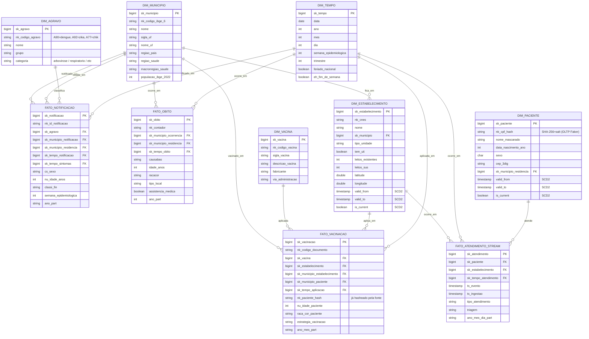

# Modelo Dimensional — Camada Gold

- **Status:** Aceito (revisado 2026-07-13)
- **Data:** 2026-05-07 · **Última revisão:** 2026-07-13
- **Escopo:** Modelagem da camada Gold (analítica) do data lake medalhão.

## Mudança de domínio (2026-07-13)

As fontes de dados migram de CSV/FTP DataSUS (SIH-SUS internações + SIM óbitos) para **REST API pública** do Ministério da Saúde. O modelo dimensional foi revisado para refletir os novos domínios:

- `fato_internacao` → **`fato_notificacao`** (arboviroses: dengue + zika + chikungunya, unificadas por `dim_agravo`)
- `fato_obito` mantém, agora via API `/vigilancia-e-meio-ambiente/sistema-de-informacao-sobre-mortalidade`
- `fato_vacinacao` novo, via API `/vacinacao/doses-aplicadas-pni-2024`
- `fato_atendimento_stream` mantém (Kafka/Faker)
- `dim_procedimento` removida (não se aplica ao novo domínio)
- `dim_agravo` nova (tipo de agravo notificável: dengue, zika, chikungunya)
- `dim_vacina` nova (vacina aplicada pelo PNI)
- `dim_paciente` mantém (OLTP Faker — demo PII masking)

## Princípios

- **Star schema** (esquema estrela) com fatos no centro e dimensões denormalizadas ao redor.
- **Surrogate keys** (`sk_*`) inteiras autoincrementais nas dimensões, geradas no Silver→Gold.
- **Natural keys** (`nk_*`) preservadas para rastreabilidade.
- **SCD Tipo 2** em dimensões com atributos que mudam ao longo do tempo (paciente, estabelecimento). Detalhes em [`ADR 0006`](./decisions/0006-scd2.md).
- **SCD Tipo 1** (sobrescrita) em `dim_municipio` (atributos descritivos podem ser atualizados sem histórico relevante).
- **SCD Tipo 0** (imutável) em `dim_cid`, `dim_procedimento`, `dim_tempo` (catálogos estáveis).
- **Particionamento** em fatos por `ano_mes` (Delta) para poda de partição em queries.
- **Mascaramento aplicado no Silver** — Gold consome apenas dados já anonimizados.

## Diagrama (star schema)

## Tabelas detalhadas

### Fatos

#### `gold.fato_internacao` — fato principal de SIH-SUS

| Coluna | Tipo | Origem |
|---|---|---|
| `sk_internacao` | bigint | Surrogate gerado no Silver→Gold |
| `nk_aih` | string | Natural key (Autorização de Internação Hospitalar) |
| `sk_paciente` | bigint | Lookup em `dim_paciente` (com SCD2 — usa `valid_from/to` da data de admissão) |
| `sk_estabelecimento` | bigint | Lookup em `dim_estabelecimento` |
| `sk_municipio_paciente` | bigint | Município de residência |
| `sk_cid_principal` | bigint | CID-10 principal |
| `sk_procedimento` | bigint | Procedimento SIGTAP |
| `sk_tempo_admissao` | bigint | Data de admissão |
| `sk_tempo_alta` | bigint | Data de alta (NULL se óbito ou em curso) |
| `dias_permanencia` | int | Métrica aditiva |
| `valor_total` | decimal(18,2) | Métrica aditiva |
| `valor_uti` | decimal(18,2) | Métrica aditiva |
| `qtd_uti` | int | Diárias de UTI (aditiva) |
| `carater_internacao` | char(1) | Eletiva/urgência |
| `desfecho` | char(1) | A=alta, O=óbito, T=transferência |
| `ano_mes_part` | string | **Coluna de particionamento Delta** |

**Chave de idempotência:** `nk_aih`. Carga via `MERGE` (upsert) — reprocessamento seguro.

#### `gold.fato_obito` — fato de SIM

| Coluna | Tipo |
|---|---|
| `sk_obito`, `nk_dec_obito` (declaração) | bigint, string |
| `sk_paciente`, `sk_municipio_ocorrencia`, `sk_cid_causa_basica`, `sk_tempo_obito` | bigint |
| `idade_obito`, `tipo_local_obito`, `assistencia_medica` | int, char, boolean |
| `ano_mes_part` | string |

#### `gold.fato_atendimento_stream` — fato vindo do Kafka

| Coluna | Tipo |
|---|---|
| `sk_atendimento` | bigint |
| `sk_paciente`, `sk_estabelecimento`, `sk_tempo_atendimento` | bigint |
| `ts_evento` | timestamp (event time) |
| `ts_ingestao` | timestamp (processing time) |
| `tipo_atendimento`, `sintomas_codificados` | string |
| `ano_mes_part` | string |

**Watermark Spark Streaming:** 1 hora (tolerância para eventos atrasados).
**Idempotência:** chave `(sk_paciente, ts_evento)` com MERGE em Delta.

### Dimensões SCD2 — exemplo de evolução

`dim_paciente` registra que paciente mudou de cidade:

| sk | nk_cpf_hash | nome_mask | sk_municipio_res | valid_from | valid_to | is_current |
|---|---|---|---|---|---|---|
| 100 | abc123... | João Silva (fake) | 3550308 (SP) | 2020-01-01 | 2024-06-30 | false |
| 101 | abc123... | João Silva (fake) | 3304557 (RJ) | 2024-07-01 | 9999-12-31 | true |

Fatos antes de 2024-07 referenciam `sk=100`; depois, `sk=101`. **Histórico preservado**.

## Política de carga

| Etapa | Estratégia | Frequência |
|---|---|---|
| Bronze→Silver | `INSERT OVERWRITE` por partição mensal | Diário (Airflow) |
| Silver→Gold (dim) | `MERGE` com lógica SCD2/SCD1 conforme dimensão | Diário |
| Silver→Gold (fato) | `MERGE` por natural key | Diário |
| Streaming → Gold | `foreachBatch` com `MERGE` Delta | Contínuo |

## Política de particionamento e otimização Delta

- **Particionamento:** `ano_mes_part` em todos os fatos.
- **Z-ORDER** após carga: `OPTIMIZE ... ZORDER BY (sk_paciente, sk_estabelecimento)`.
- **Compaction:** job semanal `OPTIMIZE` para evitar small files.
- **Vacuum:** retenção 7 dias (compliance LGPD para direito ao esquecimento via `DELETE` + `VACUUM`).
- **Schema evolution:** `mergeSchema=true` na escrita Bronze; transformação Silver consolida tipos.

## Justificativa do star schema (vs snowflake)

- **Performance:** Trino e Metabase performam melhor com joins de baixa profundidade.
- **Clareza para analistas:** dimensões denormalizadas são mais legíveis.
- **Custo de redundância** (município duplicado em paciente e estabelecimento) é aceitável em escala de saúde pública.
- **Snowflake** seria preferível se o volume de dimensões fosse problemático — não é o caso aqui.

## Referências
- Kimball, R. *The Data Warehouse Toolkit* (capítulos sobre saúde pública).
- Delta Lake docs: schema evolution, MERGE, OPTIMIZE, ZORDER.
