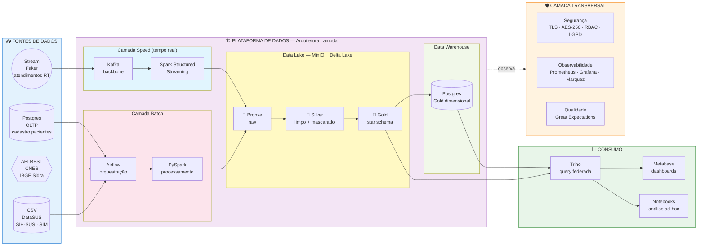

# Diagrama 1 — Arquitetura de Solução

**Audiência:** banca avaliadora + leitor de negócio
**Pergunta que responde:** *"O que essa solução faz, de onde vem o dado e quem consome?"*

## Leitura guiada

1. **À esquerda** — quatro fontes representando os formatos pedidos pelo enunciado (CSV, API, BD, stream).
2. **Centro (azul/roxo)** — a plataforma com duas camadas paralelas (Lambda): batch para o que chega periodicamente (DataSUS), speed para o que chega em fluxo contínuo (atendimentos simulados).
3. **Lake medalhão** — Bronze (raw, com PII), Silver (limpo + **mascarado**), Gold (modelo dimensional pronto para análise).
4. **Postgres DW** — espelha o Gold para queries OLAP rápidas e RBAC granular.
5. **À direita** — consumo via Trino (query federada) e Metabase (visualização final).
6. **Embaixo (laranja)** — camada transversal cobrindo segurança, observabilidade e qualidade.

## Mapeamento requisito → componente neste diagrama

| Requisito do enunciado | Onde aparece |
|---|---|
| 1. Extração | Bloco "Fontes de Dados" — 4 formatos distintos |
| 2. Ingestão | Camadas Batch e Speed (Lambda) |
| 3. Armazenamento | Lake (MinIO+Delta) + DW (Postgres) |
| 4. Observabilidade | Camada Transversal — Prometheus/Grafana/Marquez |
| 5. Segurança | Camada Transversal — TLS/AES/RBAC/LGPD |
| 6. Mascaramento | Bronze→Silver explicitado como "limpo + mascarado" |
| 7. Arquitetura | Medalhão + lake + DW + processamento distribuído (Spark) |
| 8. Escalabilidade | Spark distribuído + Kafka particionado (slide cloud detalha 10x) |
