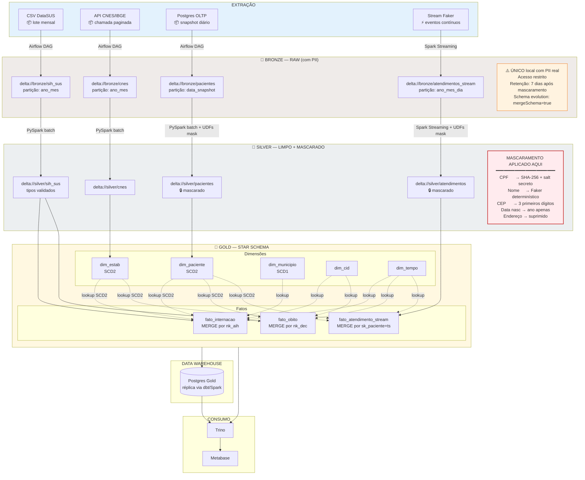

# Diagrama 2 — Fluxo de Dados (Bronze → Silver → Gold)

**Audiência:** banca técnica
**Pergunta que responde:** *"Como o dado se transforma da chegada até estar pronto para análise? Onde é mascarado? Como é versionado?"*

## Fluxo completo

## Decisões de fluxo destacadas

### 🔒 Mascaramento — onde e como

| Coluna sensível | Técnica | Reversível? | Justificativa LGPD |
|---|---|---|---|
| CPF | SHA-256 + salt secreto (Vault em prod, env em dev) | Não | Anonimização irreversível; preserva join determinístico |
| Nome | Faker com seed = hash(nk_cpf) | Não | Aparência realista para análise; não rastreia identidade |
| Data de nascimento | Generalização: só o ano | Parcial | Permite faixa etária; remove identificação fina |
| CEP | 3 primeiros dígitos (microrregião) | Parcial | Permite análise geográfica regional |
| Endereço completo | Supressão | — | Não há valor analítico justificável |
| Telefone, e-mail | Supressão | — | Idem |

**Aplicação:** UDFs PySpark em `pipelines/common/masking.py`. Mesma função usada por batch e streaming (princípio de não duplicar lógica).

### ⚙️ Idempotência por camada

| Transição | Estratégia | Razão |
|---|---|---|
| Fonte → Bronze | `INSERT` append + dedupe por hash de linha | Bronze preserva tudo; dedupe protege contra reentrega Kafka |
| Bronze → Silver | `INSERT OVERWRITE PARTITION (ano_mes)` | Reprocessar mês inteiro é seguro e barato |
| Silver → Gold (dim) | `MERGE` com lógica SCD2 | Atualiza `valid_to` da versão antiga, insere nova |
| Silver → Gold (fato) | `MERGE` por natural key | Reprocessamento de mesma AIH não duplica linha |
| Stream → Bronze | `foreachBatch` + `MERGE` por `(paciente, ts_evento)` | Garantia exactly-once com Delta |

### 🕒 Watermark e janela de streaming

- **Watermark:** 1 hora (eventos atrasados além disso são descartados e logados em DLQ).
- **Janela de agregação:** tumbling de 5 minutos para métrica `atendimentos_por_estabelecimento`.
- **Trigger:** processing time = 30s (responsivo na demo, sem CPU constante).

### 🔁 Schema evolution

- **Bronze:** `mergeSchema=true` no `writeStream`/`write` → aceita colunas novas sem quebrar.
- **Silver:** schema explícito declarado em `pipelines/common/schemas.py` → quebrar é intencional.
- **Gold:** schema versionado em dbt/SQL → migrations explícitas via dbt seeds ou Alembic.

### 🧪 Validação de qualidade (Great Expectations)

Pontos de validação obrigatórios nos DAGs:
- **Pós-Bronze:** schema mínimo, contagem > 0, nulos abaixo de threshold por coluna crítica
- **Pós-Silver:** unicidade de natural keys, integridade referencial
- **Pós-Gold:** integridade do star schema (todo fato resolve para dimensão atual ou versionada)

Falha em qualquer expectation → DAG marca falha, alerta no Grafana, dado fica retido no estágio anterior.
