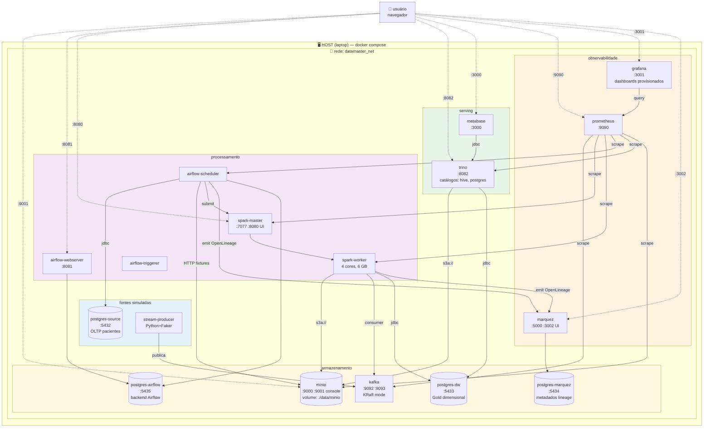

# Diagrama 3 — Deployment (Docker Compose)

**Audiência:** banca técnica + quem for reproduzir
**Pergunta que responde:** *"O que sobe quando rodo `make up`? Como esses containers se conversam? Quais portas e volumes?"*

## Topologia de containers



## Inventário de containers

| Container | Imagem base | Porta host | RAM alvo | Profile |
|---|---|---|---|---|
| postgres-source | `postgres:16-alpine` | 5432 | 256 MB | core |
| postgres-dw | `postgres:16-alpine` | 5433 | 512 MB | core |
| postgres-airflow | `postgres:16-alpine` | 5435 | 256 MB | core |
| postgres-marquez | `postgres:16-alpine` | 5434 | 256 MB | observability |
| minio | `minio/minio:latest` | 9000, 9001 | 512 MB | core |
| kafka | `bitnami/kafka:3.7` (KRaft) | 9092, 9093 | 1 GB | streaming |
| spark-master | `bitnami/spark:3.5` | 7077, 8080 | 512 MB | core |
| spark-worker | `bitnami/spark:3.5` | — | 6 GB | core |
| airflow-webserver | `apache/airflow:2.10` | 8081 | 1 GB | core |
| airflow-scheduler | `apache/airflow:2.10` | — | 1 GB | core |
| airflow-triggerer | `apache/airflow:2.10` | — | 512 MB | core |
| stream-producer | custom Python | — | 256 MB | streaming |
| trino | `trinodb/trino:latest` | 8082 | 1 GB | serving |
| metabase | `metabase/metabase:latest` | 3000 | 768 MB | serving |
| prometheus | `prom/prometheus:latest` | 9090 | 256 MB | observability |
| grafana | `grafana/grafana:latest` | 3001 | 256 MB | observability |
| marquez | `marquezproject/marquez:latest` | 5000, 3002 | 512 MB | observability |

**Total RAM alvo:** ~14 GB com tudo subido. Roda em laptop com 16 GB usando profiles seletivos.

Os profiles **reais** declarados no `docker-compose.yml`:

| Profile | Serviços | RAM aproximada |
|---|---|---|
| `core` | postgres-source, minio, minio-init | ~1 GB |
| `streaming` | kafka | +1 GB |
| `serving` | trino, metabase _(S2+)_ | +2 GB |
| `observability` | prometheus, grafana, marquez, postgres-marquez _(S4+)_ | +1 GB |

Comandos disponíveis no Makefile:

```bash
make up-s1   # core + streaming (postgres-source, minio, kafka)  — S1 atual
make up-all  # todos os profiles (core + streaming + serving + observability) — quando S2+ estiverem implementados
```

Comandos como `make up-core` ou `make up-serving` isolados **não** existem por design — a banca recebe sempre `up-all` em demo.

## Volumes persistentes

Os volumes de runtime são **Docker named volumes** (gerenciados pelo Docker, sem path no host). Cada um declarado no `docker-compose.yml` com nome exposto começando em `datamaster_*` para identificação humana.

| Volume Docker (named) | Conteúdo | Sprint introduzido |
|---|---|---|
| `datamaster_pg_source_data` | OLTP simulado (pacientes, estabelecimentos) | S1 |
| `datamaster_minio_data` | Lake Bronze/Silver/Gold em Delta | S1 |
| `datamaster_kafka_data` | Logs Kafka KRaft | S1 |
| `datamaster_pg_dw_data` | DW Gold replicado | S2 |
| `datamaster_pg_airflow_data` | Backend do Airflow | S2 |
| `datamaster_pg_marquez_data` | Metadados de lineage | S4 |
| `datamaster_prometheus_data` | Séries temporais de métricas | S4 |
| `datamaster_grafana_data` | Dashboards/datasources provisionados | S4 |

Apenas o cache de fontes e logs do Airflow são **bind mounts** ao host (porque precisam ser versionáveis ou inspecionáveis):

| Bind mount | Conteúdo | Versionado? |
|---|---|---|
| `./data/raw/` | CSVs DataSUS e fixtures de API | Sim (Git LFS) |
| `./airflow/logs/` | Logs do scheduler e tasks | Não (no `.gitignore`) |

**Limpeza:** `make down` para parar (volumes preservados); `make clean` para destruir volumes (pede confirmação literal `"apagar tudo"`).

## Redes

- **`datamaster_net`** (bridge custom) — todos os containers. Service discovery por nome interno (`postgres-source:5432`, `kafka:9092`, `minio:9000`, etc.).
- **Sem expose externo** exceto portas explicitamente publicadas no host.
- Producer/consumer Kafka **fora da rede do Compose** (ex.: rodando direto no laptop) usam o listener auxiliar `localhost:29092` (advertised diferente).

## Health checks e dependências

Todo container declara `healthcheck:` no Compose. `depends_on:` usa `condition: service_healthy` para que:
- Airflow só sobe após Postgres-airflow estar pronto
- Spark-worker só conecta após Spark-master estar pronto
- Stream-producer só publica após Kafka estar pronto
- Marquez só sobe após Postgres-marquez estar pronto

**Boot ordenado** evita corrida que comumente quebra demos ao vivo.

## Reprodutibilidade (requisito explícito do enunciado)

```bash
git clone <repo-url>
cd case-eng-dados-santander
cp .env.example .env
make warmup          # build + pull de imagens
make seed            # popula Postgres OLTP + cache de fontes
make up-all          # sobe tudo
make smoke           # valida end-to-end
open http://localhost:3000   # Metabase
```

**Pré-requisitos no host:**
- Docker 24+ e Docker Compose v2
- 16 GB RAM
- 10 GB de disco livre
- macOS / Linux (Windows via WSL2)

Versões pinadas em `.env` e em cada `image:` do Compose. Sem `:latest` em produção (já reservado apenas para imagens com tag fixa de minor, como `postgres:16-alpine`).
