# Especificação dos DAGs Airflow

> **Audiência:** quem vai codar `airflow/dags/*.py`.
> **Status:** Spec narrativa (revisada 2026-07-13 — migração de DataSUS CSV para REST API, Spark em k8s).
> **Não contém código** — descreve nome, schedule, tarefas, dependências e responsabilidades.

## Convenções gerais

### Nomeação

| Padrão | Exemplo | Uso |
|---|---|---|
| `dag_bronze_<fonte>` | `dag_bronze_dengue` | Extração REST API → landing/ → Bronze Delta |
| `dag_silver_<dominio>` | `dag_silver_notificacao` | Transformação Bronze→Silver + mascaramento |
| `dag_gold_dim_<nome>` | `dag_gold_dim_agravo` | Dimensão Gold com SCD |
| `dag_gold_fato_<nome>` | `dag_gold_fato_notificacao` | Fato Gold |
| `dag_maint_<acao>` | `dag_maint_optimize_delta` | Manutenção/operação |
| `dag_quality_<dominio>` | `dag_quality_gates_silver` | Validações Great Expectations |

### Default args (todas as DAGs herdam)

| Argumento | Valor padrão | Razão |
|---|---|---|
| `owner` | `data-eng` | Auditoria |
| `email` | `[]` | Alertas via Prometheus/Grafana |
| `email_on_failure` | `False` | Callback Slack/PagerDuty (evolução futura) |
| `retries` | `2` | Tolera flake leve |
| `retry_delay` | `timedelta(minutes=5)` | |
| `retry_exponential_backoff` | `True` | |
| `max_retry_delay` | `timedelta(minutes=30)` | Cap |
| `sla` | `timedelta(hours=2)` | Alerta se passar |
| `start_date` | `datetime(2024, 1, 1)` | Backfill possível |
| `catchup` | `False` | Backfill manual e controlado |
| `max_active_runs` | `1` | Evita corrida em backfill |
| `tags` | camada + fonte | Filtragem na UI |

### Padrão de tarefa em DAGs Bronze (duas etapas — ADR 0008)

```
┌────────────────────────────────────────────────────────────────────┐
│  pre_check                                                          │
│    → extract          [PythonOperator → landing/]                  │
│      → validate_raw   [PythonOperator — sanity check em landing/]  │
│        → ingest       [SparkKubernetesOperator → bronze/ Delta]    │
│          → quality_gate                                             │
│            → emit_lineage                                           │
│              → end                                                  │
└────────────────────────────────────────────────────────────────────┘
```

**Separação obrigatória `extract` ↔ `ingest` (ADR 0008):**

| Task | Operador | Responsabilidade |
|---|---|---|
| `pre_check` | `PythonOperator` | Verifica cache offline (`OFFLINE_MODE=1`), conectividade |
| `extract` | `PythonOperator` | Chama `pipelines/extraction/<fonte>.py` → salva JSON/NDJSON em `s3a://landing/<fonte>/` |
| `validate_raw` | `PythonOperator` | Assert `row_count > 0`, schema mínimo presente — falha rápido antes de subir JVM Spark |
| `ingest` | `SparkKubernetesOperator` | Submete `SparkApplication` CRD ao k3s; job lê landing/, escreve Delta em `s3a://bronze/` |
| `quality_gate` | `PythonOperator` ou `GreatExpectationsOperator` | Suite de validação Bronze |
| `emit_lineage` | `PythonOperator` | OpenLineage emit explícito via Marquez |

> **Por que `PythonOperator` na extração?** Chamada HTTP paginada é I/O serial — sem dado em memória para justificar JVM Spark. Startup do Spark (10–30s) tornaria a extração mais lenta. Detalhado em [ADR 0008](../architecture/decisions/0008-ingestion-layers.md).

> **Por que `SparkKubernetesOperator` na ingestão?** Escrita Delta ACID, schema enforcement, `partitionBy` e `MERGE` são operações nativas Spark. Distribuição real para Bronze→Silver→Gold. O operador submete um `SparkApplication` YAML ao k3s (Rancher Desktop) e monitora até conclusão.

### Padrão de tarefa em DAGs Silver/Gold

```
┌───────────────────────────────────────────────────────────────────┐
│  wait_upstream  →  ingest  →  quality_gate  →  emit_lineage  →   │
│  end                                                               │
└───────────────────────────────────────────────────────────────────┘
```

| Task | Operador | Responsabilidade |
|---|---|---|
| `wait_upstream` | `ExternalTaskSensor` | Aguarda DAG upstream (Bronze ou Silver) completar |
| `ingest` | `SparkKubernetesOperator` | Spark job Bronze→Silver (com mascaramento) ou Silver→Gold (com lookup dims) |
| `quality_gate` | `PythonOperator` | Suite GE específica da camada |
| `emit_lineage` | `PythonOperator` | Registra dataset output no Marquez |

### XComs

- Usar **XCom apenas para pequenas referências** — path resolvido, contagem de linhas, run_id.
- Nunca DataFrame. Chaves em snake_case: `extract.output_path`, `extract.row_count`.

### Pools

| Pool | Slots | Uso |
|---|---|---|
| `default_pool` | 32 | Default — tarefas leves |
| `spark_pool` | 4 | `SparkKubernetesOperator` — limite de jobs Spark concorrentes no k3s |
| `extraction_pool` | 8 | `PythonOperator` de extração (rate limit API) |
| `dw_load_pool` | 2 | Cargas finais no Postgres-DW (escrita serializada) |

---

## DAGs por camada

### Camada Bronze

Cada DAG Bronze cobre uma fonte REST da API `apidadosabertos.saude.gov.br`.  
Todas seguem o padrão **`extract` (PythonOperator) + `ingest` (SparkKubernetesOperator)** do ADR 0008.

#### `dag_bronze_dengue`

- **Schedule:** `@monthly` (`0 5 2 * *` — dia 2, 05:00)
- **Endpoint:** `/arboviroses/dengue?nu_ano=<ano>&offset=<n>&limit=100`
- **Cache offline:** `data/raw/dengue/` (usado quando `OFFLINE_MODE=1`)
- **Tarefas específicas:**
  - `extract`: `pipelines.extraction.arboviroses.fetch(agravo="dengue", ano=ano, offline_mode=...)`
  - `validate_raw`: assert `row_count >= 100` (dengue tem alto volume)
  - `ingest`: Spark job → `s3a://bronze/dengue/ano_mes=<>/`; campo `_source_url` preenchido
- **Downstream:** `dag_silver_notificacao`

#### `dag_bronze_zika`

- **Schedule:** `@monthly` (idem)
- **Endpoint:** `/arboviroses/zikavirus?nu_ano=<ano>`
- **Estrutura idêntica** ao `dag_bronze_dengue`; volume menor, threshold `>= 10`
- **Downstream:** `dag_silver_notificacao`

#### `dag_bronze_chikungunya`

- **Schedule:** `@monthly`
- **Endpoint:** `/arboviroses/chikungunya?nu_ano=<ano>`
- **Downstream:** `dag_silver_notificacao`

#### `dag_bronze_sim_obitos`

- **Schedule:** `@yearly` (`0 6 1 2 *` — 1º fevereiro — SIM fecha referência anual)
- **Endpoint:** `/vigilancia-e-meio-ambiente/sistema-de-informacao-sobre-mortalidade?ano=<ano>`
- **Particionamento Bronze:** `(ano_part)`
- **Downstream:** `dag_silver_sim_obitos`

#### `dag_bronze_vacinacao_pni`

- **Schedule:** `@monthly`
- **Endpoint:** `/vacinacao/doses-aplicadas-pni-2024?page=<n>`
- **Nota:** `nk_paciente_hash` já vem hasheado pelo Ministério — documentado em `bronze-schemas.md`
- **Downstream:** `dag_silver_vacinacao_pni`

#### `dag_bronze_cnes`

- **Schedule:** `@monthly`
- **Endpoint:** `/cnes/estabelecimentos?codigo_uf=<uf>&offset=<n>&limit=100`
- **Particionamento Bronze:** `(snapshot_date)`
- **Pool:** `extraction_pool` (muitas páginas, respeitar rate limit)
- **Downstream:** `dag_silver_estabelecimento`

#### `dag_bronze_municipios`

- **Schedule:** `@quarterly`
- **Endpoint:** `/macrorregiao-e-regiao-de-saude/municipio`
- **Particionamento Bronze:** `(snapshot_date)`
- **Downstream:** `dag_silver_municipio`

#### `dag_bronze_oltp_snapshot`

- **Schedule:** `@daily` (`0 1 * * *`)
- **Origem:** Postgres `oltp` schema (Faker) — não é REST API; extrator usa psycopg2
- **⚠️ Atenção:** produz Bronze **com PII** — acesso restrito, pool `dw_load_pool`
- **Downstream:** `dag_silver_paciente_mascaramento`

---

### Camada Silver

#### `dag_silver_notificacao`

- **Schedule:** `@monthly`
- **Trigger:** `ExternalTaskSensor` aguardando `dag_bronze_dengue`, `dag_bronze_zika`, `dag_bronze_chikungunya` (todos do mesmo mês — `execution_date` igual)
- **Idempotência:** `INSERT OVERWRITE PARTITION (agravo, ano_mes)`
- **Spark job:** lê as três fontes Bronze → union com coluna `cd_agravo` (`A90`/`A92`/`A77`) → parse de datas → normalização de tipos → escreve `s3a://silver/notificacao/`
- **Sem mascaramento direto** — notificações não têm CPF; `nu_notific` é ID técnico

#### `dag_silver_sim_obitos`

- **Schedule:** `@yearly`
- **Trigger:** `ExternalTaskSensor` em `dag_bronze_sim_obitos`
- **Idempotência:** `INSERT OVERWRITE PARTITION (ano_part)`
- **Spark job:** parse de datas, normalização de `causabas` (CID-10), validação de `idade_anos > 0`

#### `dag_silver_vacinacao_pni`

- **Schedule:** `@monthly`
- **Trigger:** `ExternalTaskSensor` em `dag_bronze_vacinacao_pni`
- **Spark job:** normalização de campos, validação de `nu_idade_paciente >= 0`, dedup por `nk_codigo_documento`
- **PII:** `nk_paciente_hash` já mascarado na fonte — Silver apenas valida que o campo não é nulo

#### `dag_silver_paciente_mascaramento`

- **Schedule:** `@daily` (`30 1 * * *` — 30 min após Bronze OLTP)
- **Trigger:** `ExternalTaskSensor` em `dag_bronze_oltp_snapshot`
- **Mascaramento:** aplica `pipelines.common.masking.mask_paciente()` ([ADR 0004](../architecture/decisions/0004-pii-masking.md))
- **Tarefas críticas:**
  - `validate_silver_no_pii`: assert que CPF original **não aparece** em nenhuma linha — falha aqui bloqueia todo downstream

#### `dag_silver_estabelecimento`

- **Schedule:** `@monthly`
- **Trigger:** `ExternalTaskSensor` em `dag_bronze_cnes`
- **Normalização:** limpa nome, mapeia `tp_unidade` para categórico, converte lat/lon

#### `dag_silver_municipio`

- **Schedule:** `@quarterly`
- **Trigger:** `ExternalTaskSensor` em `dag_bronze_municipios`
- **Idempotência:** `MERGE` por `nk_codigo_ibge_6`
- **Enrich:** adiciona `codigo_municipio_6` para join com notificações (campo `co_mun_not`)

---

### Camada Gold

#### `dag_gold_dim_municipio`

- **Schedule:** `@monthly` (após Silver municipio)
- **SCD:** Tipo 1 (sobrescrita) — [ADR 0006](../architecture/decisions/0006-scd2.md)
- **MERGE** por `nk_codigo_ibge_6`

#### `dag_gold_dim_agravo`

- **Schedule:** `@manual` (seed estático — dengue/zika/chikungunya mudam raramente)
- **SCD:** Tipo 0 (imutável)
- **Origem:** arquivo `dbt/seeds/agravos.csv` ou `INSERT` direto no init do Postgres

#### `dag_gold_dim_vacina`

- **Schedule:** `@monthly` (novos imunobiológicos PNI podem surgir)
- **SCD:** Tipo 1
- **Origem:** `silver.vacinacao_pni` — `DISTINCT` por `co_vacina`

#### `dag_gold_dim_estabelecimento_scd2`

- **Schedule:** `@monthly`
- **SCD:** Tipo 2 — [ADR 0006](../architecture/decisions/0006-scd2.md)
- **Chave natural:** `nk_cnes`
- **Tarefas:** `compute_attr_hash` → `merge_close_old` → `merge_insert_new` → `validate_scd2_integrity`

#### `dag_gold_dim_paciente_scd2`

- **Schedule:** `@daily`
- **SCD:** Tipo 2
- **Chave natural:** `nk_cpf_hash`
- Mesma sequência de tarefas que `dim_estabelecimento_scd2`

#### `dag_gold_dim_tempo`

- **Schedule:** `@yearly`
- **SCD:** Tipo 0
- Gera linhas para todos os dias do próximo ano + semanas epidemiológicas

#### `dag_gold_fato_notificacao`

- **Schedule:** `@monthly`
- **Trigger:** depende de `dag_silver_notificacao` + `dag_gold_dim_agravo` + `dag_gold_dim_municipio` + `dag_gold_dim_tempo`
- **Idempotência:** `MERGE` por `nk_id_notificacao`
- **Spark job:** JOIN Silver notificacao × dims; gera `sk_*` via lookup; MERGE em `gold.fato_notificacao`
- **Post-MERGE:** replica para `postgres.gold_dw.fato_notificacao` via JDBC (Metabase)

#### `dag_gold_fato_obito`

- **Schedule:** `@yearly`
- **Trigger:** depende de `dag_silver_sim_obitos` + `dag_gold_dim_municipio` + `dag_gold_dim_tempo`
- **Idempotência:** `MERGE` por `nk_contador`

#### `dag_gold_fato_vacinacao`

- **Schedule:** `@monthly`
- **Trigger:** depende de `dag_silver_vacinacao_pni` + `dag_gold_dim_vacina` + `dag_gold_dim_estabelecimento_scd2` + `dag_gold_dim_municipio` + `dag_gold_dim_tempo`
- **Idempotência:** `MERGE` por `nk_codigo_documento`

#### `dag_gold_fato_atendimento_stream_replay`

- **Schedule:** `@hourly`
- Garante que eventos processados via Structured Streaming (k8s) sejam replicados para Postgres-DW
- Lê `gold.fato_atendimento_stream` Delta → UPSERT no Postgres via JDBC

---

### Streaming (Spark Structured Streaming no k8s)

O streaming **não é um DAG batch** — é um `SparkApplication` de longa duração rodando em k3s.

#### `dag_maint_streaming_supervisor`

- **Schedule:** `*/5 * * * *`
- **Tarefa única:** `PythonOperator` faz `kubectl get sparkapplication notificacoes-stream-consumer -n spark` e verifica `status.applicationState.state == RUNNING`. Se não estiver, submete novo `SparkApplication` CRD via `SparkKubernetesOperator`.
- **Métricas:** `streaming_consumer_restarts_total` no Prometheus

> **Diferença da versão anterior:** o consumer de streaming não é mais um container persistente no Docker Compose. Roda como pod k8s gerenciado pelo `spark-on-k8s-operator`, ganhando isolamento e restart automático via CRD. Ver [ADR 0007](../architecture/decisions/0007-spark-on-kubernetes.md).

---

### Camada de Qualidade

#### `dag_quality_gates_silver`

- **Schedule:** após cada Silver (via `ExternalTaskSensor` ou Dataset API Airflow 2.4+)
- **Suites Great Expectations:**
  - `bronze_suite`: row_count > 0, schema mínimo, sem coluna PII exposta
  - `silver_suite`: NK único, tipos corretos, mascaramento validado
- Falha → bloqueia downstream Gold

#### `dag_quality_gates_gold`

- Suite para Gold: integridade referencial (SK não nula), SCD2 consistency (exactly one `is_current=true` por NK)

---

### Camada de Manutenção

#### `dag_maint_optimize_delta`

- **Schedule:** `@weekly` (`0 3 * * 0` — domingo 03:00)
- **Tarefas:**
  - `optimize_bronze`: `OPTIMIZE bronze.<table>` — compacta small files
  - `optimize_silver`: idem
  - `optimize_gold_zorder`: `OPTIMIZE gold.fato_notificacao ZORDER BY (sk_agravo, sk_municipio_notificacao)`
  - `vacuum_bronze`: `VACUUM RETAIN 168 HOURS` (7 dias — LGPD)
  - `vacuum_silver_gold`: `VACUUM RETAIN 720 HOURS` (30 dias)

#### `dag_maint_dlq_reprocessor`

- **Schedule:** `@hourly`
- Lê `notificacoes.dlq` (Kafka) com offset commitado por DAG
- Estratégias: `LATE_EVENT` → Bronze atrasado; `SCHEMA_INVALID` → human review; `UNKNOWN_FIELD` → log + descarte
- Métrica: `dlq_reprocessed_total{reason}` no Prometheus

#### `dag_maint_lgpd_erasure`

- **Schedule:** `@manual`
- **Parâmetros:** `cpf_hash` (do titular)
- **Tarefas:** `delete_oltp` → `delete_bronze` → `vacuum_bronze RETAIN 0 HOURS` → `reprocess_silver_gold` → `audit_log`

---

## Diagrama de dependências

```mermaid
flowchart TD
    B1[dag_bronze_dengue] --> SN[dag_silver_notificacao]
    B2[dag_bronze_zika] --> SN
    B3[dag_bronze_chikungunya] --> SN
    B4[dag_bronze_sim_obitos] --> SS[dag_silver_sim_obitos]
    B5[dag_bronze_vacinacao_pni] --> SV[dag_silver_vacinacao_pni]
    B6[dag_bronze_cnes] --> SE[dag_silver_estabelecimento]
    B7[dag_bronze_municipios] --> SM[dag_silver_municipio]
    B8[dag_bronze_oltp_snapshot] --> SP[dag_silver_paciente_mascaramento]

    SM --> G_DM[dag_gold_dim_municipio]
    SE --> G_DE[dag_gold_dim_estabelecimento_scd2]
    SP --> G_DP[dag_gold_dim_paciente_scd2]

    SN --> G_FN[dag_gold_fato_notificacao]
    SS --> G_FO[dag_gold_fato_obito]
    SV --> G_FV[dag_gold_fato_vacinacao]

    G_DM --> G_FN
    G_DM --> G_FO
    G_DM --> G_FV
    G_DA[dag_gold_dim_agravo] --> G_FN
    G_DT[dag_gold_dim_tempo] --> G_FN
    G_DT --> G_FO
    G_DT --> G_FV
    G_DVA[dag_gold_dim_vacina] --> G_FV
    G_DE --> G_FV

    style B1 fill:#fff8e1
    style B2 fill:#fff8e1
    style B3 fill:#fff8e1
    style B4 fill:#fff8e1
    style B5 fill:#fff8e1
    style B6 fill:#fff8e1
    style B7 fill:#fff8e1
    style B8 fill:#fff8e1
    style SN fill:#eceff1
    style SS fill:#eceff1
    style SV fill:#eceff1
    style SE fill:#eceff1
    style SM fill:#eceff1
    style SP fill:#eceff1
    style G_FN fill:#fff3e0
    style G_FO fill:#fff3e0
    style G_FV fill:#fff3e0
    style G_DM fill:#e8f5e9
    style G_DE fill:#e8f5e9
    style G_DP fill:#e8f5e9
    style G_DA fill:#e8f5e9
    style G_DVA fill:#e8f5e9
    style G_DT fill:#e8f5e9
```



---

## Estrutura de arquivos esperada

```
airflow/
├── dags/
│   ├── _common/
│   │   ├── default_args.py
│   │   ├── lineage_emit.py
│   │   ├── spark_k8s.py          # helper: monta SparkApplication YAML + SparkKubernetesOperator
│   │   └── pools.py
│   ├── bronze/
│   │   ├── dag_bronze_dengue.py
│   │   ├── dag_bronze_zika.py
│   │   ├── dag_bronze_chikungunya.py
│   │   ├── dag_bronze_sim_obitos.py
│   │   ├── dag_bronze_vacinacao_pni.py
│   │   ├── dag_bronze_cnes.py
│   │   ├── dag_bronze_municipios.py
│   │   └── dag_bronze_oltp_snapshot.py
│   ├── silver/
│   │   ├── dag_silver_notificacao.py
│   │   ├── dag_silver_sim_obitos.py
│   │   ├── dag_silver_vacinacao_pni.py
│   │   ├── dag_silver_paciente_mascaramento.py
│   │   ├── dag_silver_estabelecimento.py
│   │   └── dag_silver_municipio.py
│   ├── gold/
│   │   ├── dag_gold_dim_municipio.py
│   │   ├── dag_gold_dim_agravo.py
│   │   ├── dag_gold_dim_vacina.py
│   │   ├── dag_gold_dim_estabelecimento_scd2.py
│   │   ├── dag_gold_dim_paciente_scd2.py
│   │   ├── dag_gold_dim_tempo.py
│   │   ├── dag_gold_fato_notificacao.py
│   │   ├── dag_gold_fato_obito.py
│   │   ├── dag_gold_fato_vacinacao.py
│   │   └── dag_gold_fato_atendimento_stream_replay.py
│   ├── quality/
│   │   ├── dag_quality_gates_silver.py
│   │   └── dag_quality_gates_gold.py
│   └── maint/
│       ├── dag_maint_optimize_delta.py
│       ├── dag_maint_streaming_supervisor.py
│       ├── dag_maint_dlq_reprocessor.py
│       └── dag_maint_lgpd_erasure.py
└── plugins/
    └── operators/
        └── (nenhum custom necessário — SparkKubernetesOperator via apache-airflow-providers-cncf-kubernetes)
```

---

## Total previsto

- **8 DAGs Bronze** (dengue, zika, chikungunya, sim_obitos, vacinacao_pni, cnes, municipios, oltp_snapshot)
- **6 DAGs Silver** (notificacao, sim_obitos, vacinacao_pni, paciente_mascaramento, estabelecimento, municipio)
- **10 DAGs Gold** (6 dim + 4 fato, incluindo stream_replay)
- **2 DAGs Quality**
- **4 DAGs Maintenance**
- **TOTAL: 30 DAGs**

**Prioridade de implementação:**

| Sprint | DAGs obrigatórias | Cobertura |
|---|---|---|
| Mínimo viável | dag_bronze_dengue + dag_silver_notificacao + dag_gold_fato_notificacao + 3 dims (municipio, agravo, tempo) | Pipeline E2E demonstrável |
| Streaming | + dag_maint_streaming_supervisor | Lambda completo |
| Qualidade | + dag_quality_gates_silver + dag_maint_optimize_delta | GE + Delta maintenance |
| Completo | Todos os 30 | Demo completa |

---

## FAQ Técnico

| Pergunta | Resposta de 30s |
|---|---|
| Por que `PythonOperator` para extração e não Spark direto? | Chamada HTTP paginada é I/O serial — não há dado em memória para justificar a JVM Spark. Startup do Spark (10–30s) tornaria a extração mais lenta sem nenhum benefício. Detalhado no ADR 0008. |
| Por que `SparkKubernetesOperator` e não `SparkSubmitOperator`? | Spark roda em k3s (Rancher Desktop), não em cluster Standalone. `SparkKubernetesOperator` submete um `SparkApplication` CRD ao k8s, que é monitorado pelo spark-on-k8s-operator — isolamento por job, sem acoplamento ao Airflow. |
| Como você lida com dependências entre DAGs? | `ExternalTaskSensor` aguarda upstream; opcionalmente `Dataset` API do Airflow 2.4+ (declarativo). |
| Por que `catchup=False`? | Evita "tempestade de catchup" no primeiro deploy. Backfill é manual e controlado. |
| Streaming não tem DAG normal — como você gerencia? | SparkApplication CRD rodando no k3s. DAG supervisor a cada 5min verifica o pod via `kubectl`; se não estiver `RUNNING`, submete novo CRD. Métricas de uptime no Grafana. |
| Como você testa os DAGs sem rodar o Spark? | `OFFLINE_MODE=1` + dados em `data/raw/` — o `extract` usa cache local; o `ingest` pode ser testado com `--dry-run`. Suite de unit tests em `tests/dags/` com `dag.test()` (Airflow 2.5+). |

## Referências

- **ADR 0007:** [Spark on Kubernetes](../architecture/decisions/0007-spark-on-kubernetes.md)
- **ADR 0008:** [Separação de Camadas de Ingestão](../architecture/decisions/0008-ingestion-layers.md)
- **ADR 0004:** [Mascaramento PII](../architecture/decisions/0004-pii-masking.md)
- **ADR 0006:** [SCD2](../architecture/decisions/0006-scd2.md)
- **Airflow Best Practices:** <https://airflow.apache.org/docs/apache-airflow/stable/best-practices.html>
- **SparkKubernetesOperator:** <https://airflow.apache.org/docs/apache-airflow-providers-cncf-kubernetes/stable/operators/spark_kubernetes.html>
- **OpenLineage Airflow:** <https://openlineage.io/docs/integrations/airflow/>
